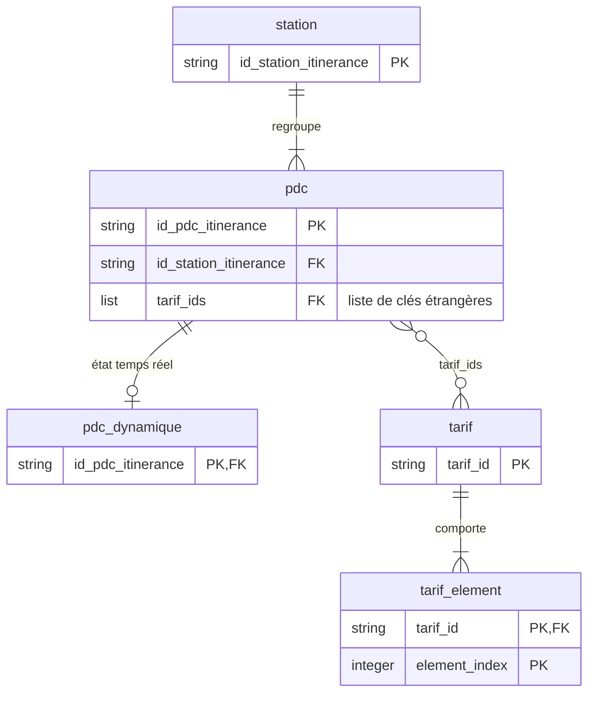

# Schéma IRVE v3 : note de conception

*Version `3.0.0-alpha.1` · octobre 2026*

> **Version alpha.** Cette note accompagne une version alpha du schéma. Le schéma est relativement finalisé ; cette note pourra toutefois évoluer et contenir encore des erreurs ou des imprécisions. Vos retours sont les bienvenus, à [irve@transport.data.gouv.fr](mailto:irve@transport.data.gouv.fr) ou par un ticket sur le [dépôt GitHub](https://github.com/etalab/schema-irve/issues/new).

> **Statut.** La spécification du schéma IRVE v3 est constituée des fichiers [Table Schema](https://specs.frictionlessdata.io/table-schema/) publiés sur le dépôt [`etalab/schema-irve`](https://github.com/etalab/schema-irve/tree/v3-wip), complétés de deux JSON Schema pour les colonnes `restrictions` et `price_components` du fichier tarifs ([`restrictions.schema.json`](../tarifs/restrictions.schema.json), [`price-components.schema.json`](../tarifs/price-components.schema.json), référencés par la propriété `x-json-schema` du champ). Ce sont ces fichiers qui font foi ; cette note en explique les objectifs et les choix.

> **Annexes.** La liste détaillée des champs et la correspondance avec AFIR figurent dans les [annexes](note-conception-irve-v3-annexes.md), générées automatiquement à partir des schémas. Elles sont temporaires : elles remplacent l'affichage des champs sur [schema.data.gouv.fr](https://schema.data.gouv.fr/), qui ne sera disponible que pour la version finale `3.0.0`.

## L'essentiel de cette nouvelle v3

- **Trois fichiers CSV**, décrits par des Table Schema : **statique** (une ligne par point de recharge, enrichi depuis la v2), **dynamique** (état en temps réel, une ligne par point de recharge) et **tarifs** (nouveau : prix de la recharge ad hoc, sur le modèle OCPI).
- **Objectif principal : couvrir les données exigées par le règlement AFIR** (tableaux A, B et F de l'annexe du [règlement d'exécution (UE) 2025/655](https://eur-lex.europa.eu/legal-content/FR/TXT/HTML/?uri=CELEX:32025R0655)). Chaque champ concerné est annoté avec l'entrée AFIR qu'il porte.
- **Le formalisme reprend et étend celui de la v2** : CSV et Table Schema, complétés de deux JSON Schema pour les colonnes `restrictions` et `price_components` du fichier tarifs. Les informations structurées (listes de valeurs, éléments tarifaires) sont portées par des **colonnes JSON** à l'intérieur du CSV : un compromis expliqué en [section 3.1](#31-des-colonnes-json-dans-un-fichier-csv).
- **Des identifiants préfixés AFIREV** pour les stations, les points de recharge et les tarifs garantissent l'unicité nationale sans registre supplémentaire.
- La v3 rassemble le contenu demandé par AFIR dans un format CSV proche des pratiques actuelles des producteurs, étape intermédiaire vers DATEX II.
- Les **contrôles de cohérence** déclarés dans les schémas sont **en cours d'affinage**.

---

## 1. Objectifs

1. **Couvrir les données exigées par AFIR.** Le règlement (UE) 2023/1804 (AFIR) oblige les exploitants de points de recharge ouverts au public à mettre certaines données à disposition. Son [règlement d'exécution (UE) 2025/655](https://eur-lex.europa.eu/legal-content/FR/TXT/HTML/?uri=CELEX:32025R0655) en fixe le contenu dans les [tableaux de son annexe](https://eur-lex.europa.eu/legal-content/FR/TXT/HTML/?uri=CELEX:32025R0655#anx_1) : tableau A (24 entrées statiques communes), tableau B (10 entrées propres à la recharge électrique) et tableau F (3 entrées dynamiques). Son [article 3](https://eur-lex.europa.eu/legal-content/FR/TXT/HTML/?uri=CELEX:32025R0655#art_3) exige que tous ces types de données soient mis à disposition, certains n'étant dus que « le cas échéant », selon l'annexe.
2. **Améliorer la qualité du fichier national.** Certaines erreurs reviennent régulièrement dans les données publiées : coordonnées inversées ou saisies au niveau du point plutôt que de la station, connecteurs déclarés comme des points de recharge, identifiants absents ou en double, codes INSEE confondus avec des codes postaux. La v3 vise à les limiter par des noms de champs plus explicites et des contraintes plus strictes.
3. **Rendre le prix de la recharge lisible.** Le prix ad hoc (F3) est une information très attendue des usagers et encore peu présente dans les données ouvertes.
4. **Limiter le coût d'adoption** de la v3 pour les producteurs, le PAN et les réutilisateurs.
5. **Rester validable, consolidable et diffusable à grande échelle.** Le fichier national agrège aujourd'hui plus de 1 800 fichiers, publiés par de nombreux producteurs. La taille des fichiers, la bande passante nécessaire à leur diffusion et le coût de leur consolidation doivent rester maîtrisés (voir 3.1).

**Vers DATEX II.** Le [règlement d'exécution](https://eur-lex.europa.eu/legal-content/FR/TXT/HTML/?uri=CELEX:32025R0655#art_1) prévoit une diffusion au format DATEX II. La v3 part de la v2, déjà produite à grande échelle (plus de 165 000 points de recharge en statique, une part croissante en dynamique) : c'est le point de départ le plus pragmatique. Une représentation DATEX II semble, sur le papier, dérivable de la v3.

---

## 2. Modèle de données

Les données sont réparties en trois fichiers, reliés par des identifiants : le fichier statique décrit les stations et leurs points de recharge, le fichier dynamique l'état de chaque point en temps réel, le fichier tarifs les prix applicables à chaque point.

Le diagramme ne montre que les entités retenues et les clés. L'ensemble des champs, avec leurs types, contraintes et descriptions, est défini dans les schémas [`schema-statique.json`](../statique/schema-statique.json), [`schema-dynamique.json`](../dynamique/schema-dynamique.json) et [`schema-tarifs.json`](../tarifs/schema-tarifs.json), et récapitulé en [annexe A](note-conception-irve-v3-annexes.md#a-champs-des-trois-fichiers).

| Fichier | Une ligne correspond à | Clé | Entités décrites |
|---|---|---|---|
| statique | un point de recharge (pdc) | `id_pdc_itinerance` | `station` (champs répétés sur chaque pdc de la station) et `pdc` |
| dynamique | un point de recharge | `id_pdc_itinerance`, clé étrangère vers le statique | `pdc_dynamique` |
| tarifs | un élément tarifaire | (`tarif_id`, `element_index`) | `tarif` (champs répétés sur chaque ligne du tarif) et `tarif_element` |

> **`tarif_ids`** liste les tarifs applicables à un point de recharge, sur des périodes de validité successives ; un même tarif peut servir à plusieurs points. Chaque identifiant doit exister dans le fichier tarifs. Table Schema ne sachant pas déclarer ce lien sur une colonne de type liste, il n'est pas vérifié par les validateurs génériques, mais le sera par le validateur du PAN (contrôle `foreign-key-array`).

---

## 3. Choix de conception

### 3.1 Des colonnes JSON dans un fichier CSV

Treize colonnes du fichier statique contiennent une liste JSON (ex. `type_vehicule`, `equipement_afir`, `paiement_ad_hoc`, `tarif_ids`), et deux colonnes du fichier tarifs un objet ou une liste d'objets (`restrictions`, `price_components`). Ce mélange répond à trois besoins.

- **Un chemin d'évolution sans rupture.** Rester en CSV permet de passer à la v3 sans changer d'outillage. Les listes permettent ensuite au schéma d'évoluer sans multiplier les colonnes : une nouvelle catégorie de véhicule ou d'équipement s'ajoute à une énumération, sans changer la structure du fichier. Les connecteurs font exception : les types principaux conservent une colonne booléenne chacun (`prise_type_*`), comme en v2.
- **Un compromis pour les producteurs qui parlent OCPI.** `restrictions` et `price_components` sont calqués sur les objets `TariffRestrictions` et `PriceComponent` d'OCPI ; `equipement_ocpi` reprend son énumération, et `prise_type_autre` accepte ses noms de connecteurs (par exemple `IEC_62196_T3C` ou `GBT_DC`). Un tarif OCPI se transpose avec un retraitement limité (prix en TTC, horodatages normalisés). Les producteurs qui n'utilisent pas OCPI gardent un fichier plat, et une structure tarifaire complète tient dans un seul fichier supplémentaire.
- **Valider, consolider et diffuser au niveau national.** Le contenu des colonnes JSON est contraint (énumérations, motifs, JSON Schema dédiés) et validable cellule par cellule. Chaque ligne restant autonome, les fichiers de tous les producteurs s'agrègent relativement aisément. Les listes et objets se représentent sans conversion dans un format comme Parquet : les consolidations statique et dynamique peuvent être diffusées, en plus du CSV, dans un format compressé et typé, par exemple Parquet, ce qui réduit volumes et bande passante, autant pour les producteurs que pour les consolidateurs (le PAN) et les réutilisateurs.

Dans le CSV, une cellule JSON est entourée de guillemets et ses guillemets internes sont doublés (RFC 4180) : `"[""sanitaires"",""restauration""]"`.

### 3.2 Liste fermée + liste libre

Quand AFIR énumère des valeurs tout en admettant « autre », la v3 utilise une liste fermée, contrainte par énumération (ex. `type_vehicule` : `L`, `M1`… `N3`), et une liste libre suffixée `_autre`. Les valeurs fermées restent exploitables automatiquement sans priver le producteur d'une réponse exacte ; une valeur libre fréquente pourra rejoindre l'énumération dans une version ultérieure.

### 3.3 Cellule vide = information inconnue

Pour les booléens et listes introduits par AFIR, `true` (ou une liste non vide) et `false` (ou `[]`) sont des déclarations ; une **cellule vide** signifie que l'information n'est pas connue. Forcer une réponse produirait des données fausses. Le schéma n'impose pour l'instant que les informations que tout producteur détient (identifiants, localisation, puissance, connecteurs…) ; le caractère obligatoire des autres champs sera resserré progressivement dans les versions suivantes. Quelques champs hérités de la v2 représentent l'inconnu par une valeur explicite (`inconnu`, `Accessibilité inconnue`).

### 3.4 Identifiants préfixés AFIREV

Les identifiants de station (`FR…P…`), de point de recharge (`FR…E…`) et de tarif (`FR…T…`) commencent par `FR` et le code de l'unité d'exploitation attribué par l'AFIREV : l'unicité nationale est garantie par construction. La valeur « Non concerné » n'est plus acceptée : tout point ouvert au public doit disposer d'un identifiant délivré selon l'article 10 du décret n° 2017-26.

### 3.5 Champs dérivés plutôt que saisis

Le pays (A9), la région (A10), la commune (A11) et le fuseau horaire (A15) ne font l'objet d'aucune colonne : ils se déduisent du code INSEE et du caractère national du schéma. Les demander ajouterait de la saisie et des incohérences possibles, sans information nouvelle.

---

## 4. Le fichier tarifs

Le fichier tarifs couvre le prix ad hoc (F3). Il reprend le modèle tarifaire OCPI.

- **Structure.** Chaque ligne est un élément tarifaire (`TariffElement` OCPI) ; les lignes d'un même `tarif_id` composent un tarif. `restrictions` décrit les conditions d'application (plage horaire, jours, durée, énergie, puissance…), `price_components` les prix (`ENERGY` au kWh, `TIME` et `PARKING_TIME` à l'heure, `FLAT` forfait).
- **Sélection.** Comme en OCPI, pour chaque type de composant s'applique le premier élément, dans l'ordre de `element_index`, dont les restrictions sont satisfaites. Les restrictions s'entendent en heure locale de la station.
- **Prix ad hoc uniquement, TTC, en euros.** Seul `AD_HOC_PAYMENT` est actuellement accepté : le prix payé sous abonnement relève du fournisseur de services de mobilité. À la différence d'OCPI, tous les prix sont TTC.
- **Exemple.** Le fichier [`exemple-valide-tarifs.csv`](../tarifs/exemple-valide-tarifs.csv) décrit un tarif à environ 0,33 €/kWh le jour et 0,21 €/kWh la nuit, avec des frais de temps et de stationnement croissants au-delà de 2 h puis 3 h de session.

---

## 5. Couverture d'AFIR et écarts assumés

Les 37 entrées des tableaux A, B et F ont toutes une correspondance dans la v3 (détail en [annexe B](note-conception-irve-v3-annexes.md#b-correspondance-avec-les-tableaux-a-b-et-f-dafir)).

Écarts de forme assumés par rapport à l'annexe :

| Entrée | Annexe AFIR | v3 | Raison |
|---|---|---|---|
| A15 | Fuseau au format ISO 8601 (décalage) | Zone IANA dérivée (`Europe/Paris`) | Le décalage varie avec l'heure d'été, la zone est fixe ; le décalage se calcule depuis la zone |
| A20 à A24 | Niveau station | Niveau point | Agrégeable à la station ; rend compte des points n'offrant pas tous les mêmes moyens |
| B7 | Nom des fournisseurs de mobilité | Codes AFIREV (`emsp`) | Univoques et contrôlables ; le nom se retrouve dans le registre AFIREV |
| F1, F2 | Pas de valeur « inconnu » | `inconnu` admis | Accepté par le schéma, au même titre qu'une cellule vide |
| F2 | « Libre » = non occupé et utilisable | `occupation_pdc` découplé de `etat_pdc` | La disponibilité AFIR se déduit de `libre` et `en_service` ; la réservation future n'est pas couverte |
| F3 | Prix par minute | Prix à l'heure (`TIME`, `PARKING_TIME`) | Reprise d'OCPI ; conversion par division par 60 |

---

## 6. Contrôles de cohérence

Au-delà des types, motifs et énumérations, les schémas statique et tarifs déclarent des contrôles métier (`custom_checks`) : trigrammes AFIREV, SIREN, cohérence des coordonnées, du code postal et du code INSEE, connecteurs déclarés comme points, liens vers les tarifs… Les validateurs génériques ne les exécutent pas ; le validateur du PAN les met en œuvre.

> **⚠ Contrôles en cours d'affinage.** Ils ne sont pas encore alignés sur les champs de la v3 et ne doivent pas être pris au pied de la lettre. Leur liste, leurs paramètres et leur sémantique seront revus dans les toutes prochaines versions (liste actuelle en [annexe D](note-conception-irve-v3-annexes.md#d-contrôles-déclarés-custom_checks)).

---

## 7. Publication, validation, diffusion

- **Publication.** Les producteurs publient leurs fichiers sur data.gouv.fr, à une URL stable. Pour les fichiers dynamique et tarifs, cette URL pointe vers un fichier régénéré à chaque modification, sur le modèle des flux dynamiques IRVE existants.
- **Fréquence** ([article 2](https://eur-lex.europa.eu/legal-content/FR/TXT/HTML/?uri=CELEX:32025R0655#art_2) du règlement d'exécution) : au plus tard 24 heures après une modification pour le fichier statique, une minute pour les données dynamiques, ce qui inclut le fichier tarifs (le prix ad hoc relève du tableau F). Chaque ligne porte son horodatage de mise à jour, en UTC.
- **Validation et consolidation.** Le PAN valide chaque fichier contre son schéma et agrège les fichiers valides en consolidations nationales, statique et dynamique, diffusées en CSV et, par exemple, en Parquet.
- **Versionnement.** Le schéma suit le [versionnement sémantique](https://semver.org/lang/fr/) : la v3 rompt la compatibilité avec la v2. La version `3.0.0-alpha.1` est soumise à concertation ; des ajustements restent possibles.

---

## Textes de référence

- Règlement (UE) 2023/1804 (AFIR), article 20 : [version consolidée en français](https://eur-lex.europa.eu/legal-content/FR/TXT/HTML/?uri=CELEX:02023R1804-20260108#art_20) ; son paragraphe 2 a été remplacé par le [règlement délégué (UE) 2025/671](https://eur-lex.europa.eu/legal-content/FR/TXT/?uri=CELEX:32025R0671).
- Règlement d'exécution (UE) 2025/655 : [texte en français](https://eur-lex.europa.eu/legal-content/FR/TXT/HTML/?uri=CELEX:32025R0655), [annexe (tableaux A à G)](https://eur-lex.europa.eu/legal-content/FR/TXT/HTML/?uri=CELEX:32025R0655#anx_1).
- Loi n° 2019-1428 du 24 décembre 2019 d'orientation des mobilités ; décret n° 2017-26 du 12 janvier 2017, modifié par le [décret n° 2021-546](https://www.legifrance.gouv.fr/jorf/id/JORFTEXT000043475363) ; arrêtés du 12 janvier 2017 relatifs [aux données](https://www.legifrance.gouv.fr/jorf/id/JORFTEXT000033860733) et [aux identifiants](https://www.legifrance.gouv.fr/jorf/id/JORFTEXT000033860743).
- [AFIREV](https://afirev.fr/fr/informations-generales/) ; [OCPI, module tarifs](https://github.com/ocpi/ocpi/blob/v2.3.0/mod_tariffs.asciidoc) ; [Table Schema](https://specs.frictionlessdata.io/table-schema/).
